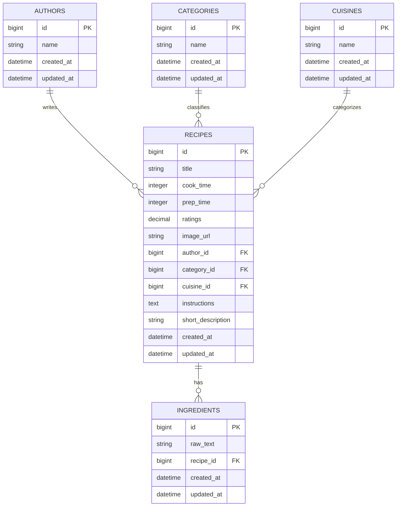

# Database

## Overview

This database stores recipes and their related metadata (authors, categories, cuisines, and ingredients). 
A recipe is the core entity. Ingredients are stored as raw text rows and linked to recipes for searching and relevance ranking.

### 📦 Key Tables

- `recipes`: holds core metadata like title, rating, cook/prep time, image URL, short description, and instructions for search and display
- `ingredients`: stores individual **raw strings** (e.g. `"2 eggs"`, `"½ cup milk"`) associated with a recipe, used for matching/relevance ranking
- `authors`, `categories`, `cuisines`: normalized for clean associations and potential filtering

### ⚖️ Design Decision: Raw Ingredients over Normalized Entities

Although a more normalized structure could have been used for ingredients (to separate ingredient by name, unit, measurement unit type), this was intentionally avoided for the following reasons:

- 🧠 The source ingredient data is **highly variable and inconsistent** (e.g. `"2 eggs"`, `"1 egg"`, `"egg yolks"`, `"beaten eggs"`), making automatic parsing error-prone
- ⏱️ Attempting to extract consistent quantity, unit, and name would have added significant complexity without clear value for this project scope
- 🚀 Instead, raw ingredient text is stored and searched with **fuzzy matching (ILIKE)** and **trigram indexing**, which gives good relevance without full normalization

This tradeoff keeps the schema simple, performant, and tailored for full-text ingredient search — rather than structured nutrition breakdown or measurement conversions.

## ⚡ Performance Optimizations - indexing

To ensure fast searches (goal: under **200ms** on Render), the following is in place:

- **PostgreSQL GIN index** on `ingredients.raw_text`, enabling trigram-accelerated ILIKE queries
- 🔥 **Measured local speedup**: recipe queries improved from **270ms → 80ms** after adding the index
- Foreign key indexes exist for recipe relationships.

## Entity Relationship Diagram

